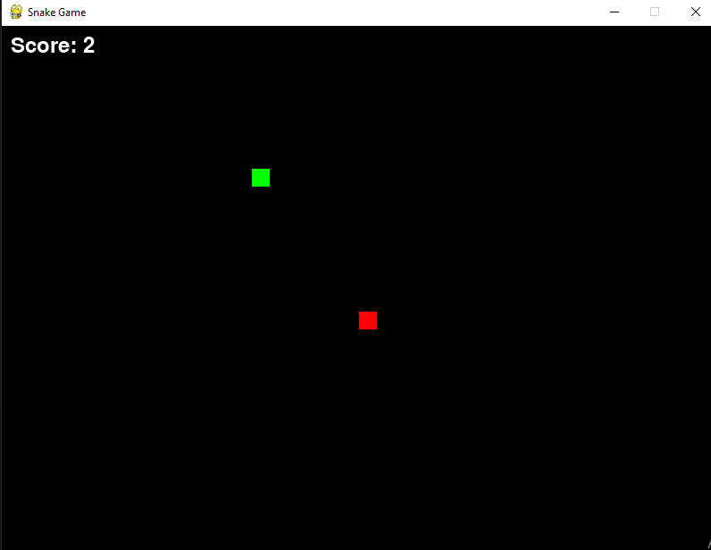

# Fighter Plane Game

This is a simple fighter plane game implemented using the Pygame library in Python. In this game, you control a player's aircraft and shoot down enemy planes while avoiding collisions. The game features basic player movement, bullet firing, enemy spawning, collision detection, and scoring.

## Getting Started

To run the game, you need to have Python and Pygame installed on your system.

1. **Install Python**: You can download and install Python from the [official Python website](https://www.python.org/).

2. **Install Pygame**: Pygame can be installed using pip, the Python package installer. Open your command-line interface and run the following command:
    ```
    pip install pygame
    ```

3. **Download the Game**: Download the Python script provided in this repository.

4. **Run the Game**: Open a terminal or command prompt, navigate to the directory containing the downloaded script, and run the script using Python:
    ```
    python fighter_plane_game.py
    ```

## Game Controls

- **Left Arrow**: Move the player's aircraft left.
- **Right Arrow**: Move the player's aircraft right.
- **Spacebar**: Fire bullets from the player's aircraft.

## Gameplay

- Control the player's aircraft using the left and right arrow keys.
- Shoot down enemy planes by pressing the spacebar to fire bullets.
- Avoid colliding with enemy planes.
- Score points for each enemy plane shot down.
- The game ends if the player's aircraft collides with an enemy plane.
- Achieve a score of 200 to complete the level and restart the game.

## Credits

This game was created by [Soumik Deb Niloy].

# Interface: 


# Snake Game

This is a simple Snake game implemented in Python using the Pygame library.

## Features

- Control the snake using arrow keys.
- Eat food to grow the snake.
- Avoid colliding with walls or the snake itself.
- Complete the level by reaching a score of 10.
- Display score on the screen.
- Level complete message is shown when the score reaches 10.

## How to Play

1. Use the arrow keys to control the direction of the snake.
2. The snake will move continuously in the direction it is facing.
3. Eat the food (red squares) to grow the snake and increase your score.
4. Avoid colliding with the walls or the snake itself.
5. Reach a score of 10 to complete the level and see the level complete message.

## Dependencies

- Python 3.x
- Pygame library (`pip install pygame`)

## Getting Started

To run the game, you need to have Python and Pygame installed on your system.

1. **Install Python**: You can download and install Python from the [official Python website](https://www.python.org/).

2. **Install Pygame**: Pygame can be installed using pip, the Python package installer. Open your command-line interface and run the following command:
    ```
    pip install pygame
    ```

3. **Download the Game**: Download the Python script provided in this repository.

4. **Run the Game**: Open a terminal or command prompt, navigate to the directory containing the downloaded script, and run the script using Python:
    ```
    python snake.py
    ```

# Interface: 

